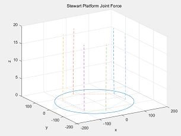
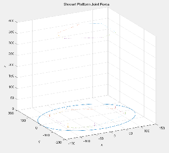

# stewart_platform_Dynamics

### reference paper
https://www.researchgate.net/publication/220103568_Kinematic_and_dynamic_analysis_of_Stewart_platform-based_machine_tool_structures


### --------- 
This is the inverse Dynamics code of the Stewart platform.   
You can see the Joint Force supporting the platform weight in figure    
   
Actual Size image(with Endeffector Plate)   



Cartesian Space = {x,y,z, Euler_z,Euler_x,Euler_z}   
input: Cartesian position, velocity, Acceleration   
Output: Joint Force   
   
Cartesian Space -> Joint Space    


### Usage
run 
```bash
main.m
```
